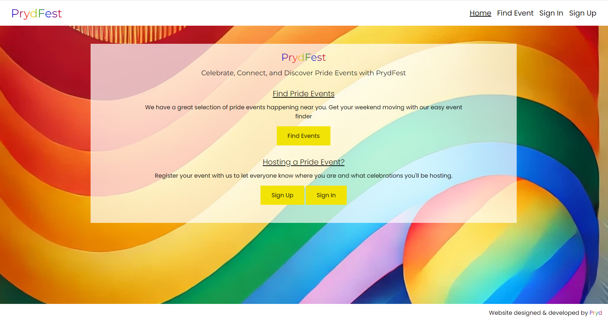

<h1 align="center"><strong>🏳️‍🌈🏳️‍🌈🏳️‍🌈 Proud Coders: July 2024 Hackathon 🏳️‍🌈🏳️‍🌈🏳️‍🌈</strong>

</h1>

# SUBMISSION

## Deployment

The project is deployed and can be accessed at [https://prydfest-918fa0deecd1.herokuapp.com/#](https://prydfest-918fa0deecd1.herokuapp.com/#).

## Criteria

In this section, we will briefly discuss how our team addressed the applicable criteria:

- 🏳️‍🌈 **The project demonstrates an impact on the LGBTQIA+ community:**
    
    PrydFest provides a centralized platform for LGBTQIA+ individuals and allies to find and host Pride events. This facilitates greater community engagement and support, helping to celebrate and promote inclusivity.

- 🏳️‍🌈 **The project is realistic and has real world value**
    
    By offering an easy-to-use interface for event discovery and creation, PrydFest addresses the need for a dedicated space where Pride events can be shared and accessed, making it a practical tool for event organizers and attendees alike.

- 🏳️‍🌈 **The project has excellent design and layout**
    
    Our design prioritizes user experience with a clean, intuitive interface that makes navigation seamless. We used vibrant colors and imagery that resonate with the Pride theme, ensuring the app is both visually appealing and functionally robust.

- 🏳️‍🌈 **The project is presented to the judges in a professional manner**
    
    Throughout the hackathon, our team maintained a high level of professionalism in our approach, from planning and execution to presentation. Our final submission includes comprehensive documentation, a live demo, and clear explanations of our development process and achievements.

- 🏳️‍🌈 **The project demonstrates innovation and creativity**
    
    PrydFest stands out by integrating features such as user authentication for event posting, responsive design for accessibility across devices, and a focus on community-driven content. Our creative approach ensures that the app not only serves a functional purpose but also fosters a sense of belonging and celebration within the LGBTQIA+ community.

# ABOUT SUBMISSION

## Intro

PrydFest is a web application designed to connect and celebrate the LGBTQIA+ community by providing a platform where users can find and host Pride events. Our project aims to foster a sense of community, inclusivity, and celebration by making it easier for individuals to discover events that celebrate diversity and promote equality.

## Goal

The goal of PrydFest is to create a user-friendly platform that supports the LGBTQIA+ community by providing:

- Problem Statement: There is a need for a centralized platform where LGBTQIA+ individuals can find and share information about Pride events.
- Objective(s): To enable users to find and host Pride events with ease, ensuring that these events are accessible to a wide audience.
- Target Audience: LGBTQIA+ individuals and allies looking for Pride events to attend or host.
- Benefits: Increased visibility for Pride events, fostering a stronger sense of community and support, and providing a platform for event hosts to reach a broader audience.

## Tech
To build our Application we used:

- Backend: Django (Python)
- Frontend: HTML, CSS, JavaScript
- Database: SQLite (development), PostgreSQL (production)
- Authentication: Django-allauth for user registration and authentication
- Deployment: Heroku
- Other Tools: Whitenoise for static files management, Django-environ for environment variable management

## Wireframes

Below are the Wireframes create by team members in order to visualised the application, Some design aspects did change whilst building the project.

### Find Event page 

#### Desktop

#### Mobile

### Create event page idea

### Event overview page idea (however color scheme is not correct so be aware of that)

#### Desktop

#### Mobile

## Credits

- Team members: Jamie, Barnaby, Joe, Mish, Alisha

As a team with give special thanks to all those that work hard to make the hackathon possible.
Additionally, we want to give a massive shout-out to Stephen, our facilitator. his unwavering support and encouragement were invaluable.