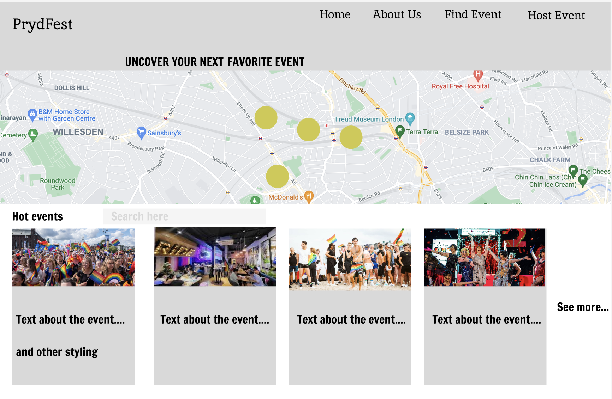
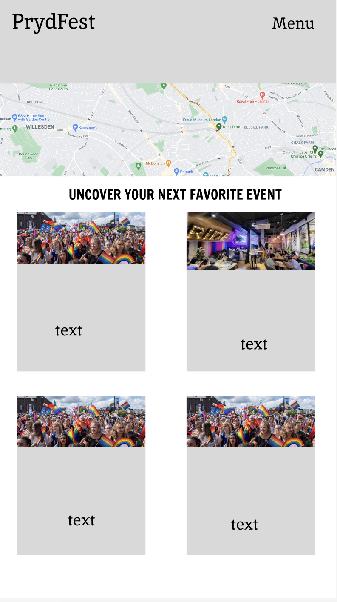
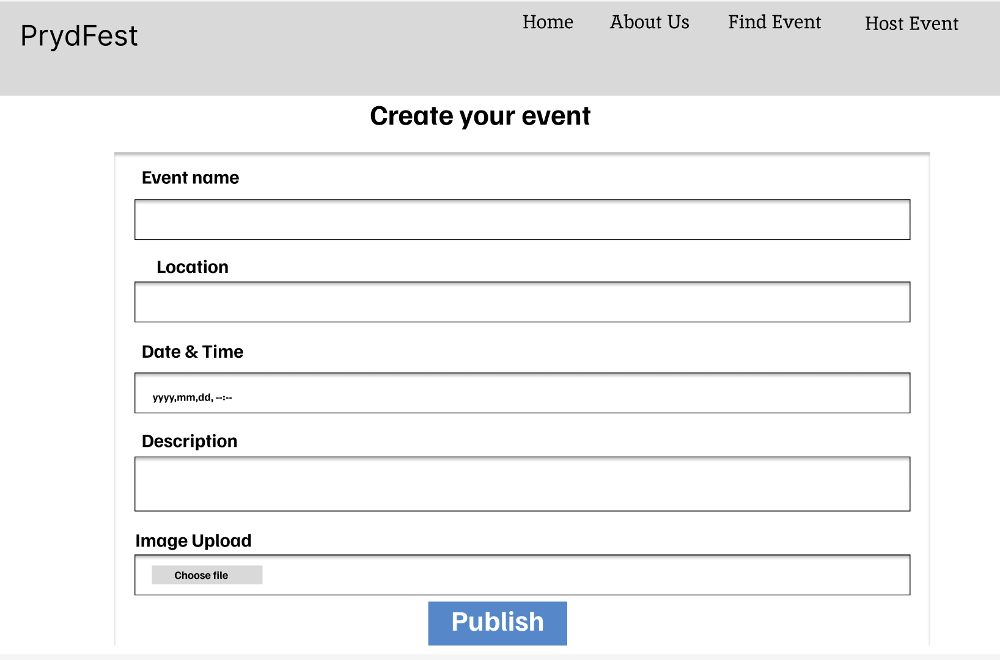
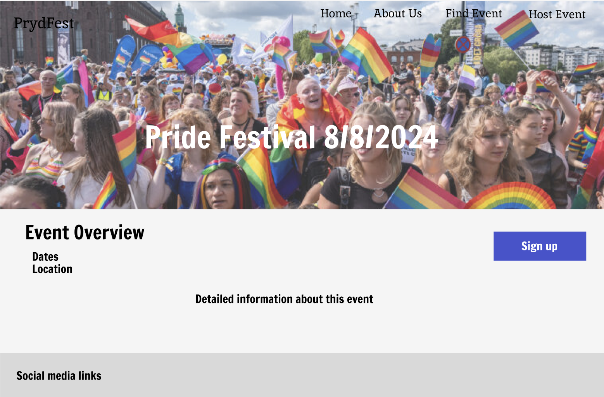
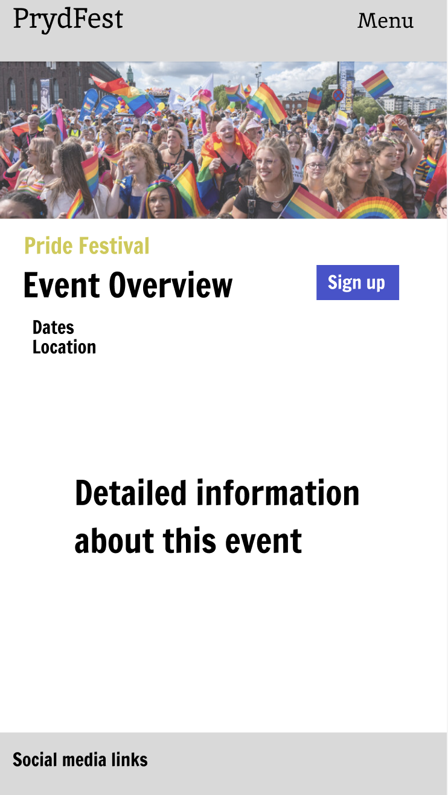

Code Institute | Pride Hackathon 

First branch commit
Mish successfulgit 
joe succesful 2 now with rules ENFORCED!

<h3>THIS TEMPLATE IS ONLY TO BE USED ON THE JULY HACKATHON PROJECT</h3>
<h4>Please do not use it for the course project work</h4>
 
<h1 align="center"><strong>🏳️‍🌈🏳️‍🌈🏳️‍🌈 Proud Coders: July 2024 Hackathon 🏳️‍🌈🏳️‍🌈🏳️‍🌈</strong>

</h1>

# SUBMISSION

## Deployment

#### _(please note, your team must also include the deployed links in the usual submission in Hackapp)_

The project is deployed and can be accessed at [http://your-deployed-link.com](http://your-deployed-link.com).

## Criteria

In this section, we will briefly discuss how our team addressed the applicable criteria:

- 🏳️‍🌈 The project demonstrates an impact on the LGBTQIA+ community
- 🏳️‍🌈 The project is realistic and has real world value
- 🏳️‍🌈 The project has excellent design and layout
- 🏳️‍🌈 The project is presented to the judges in a professional manner
- 🏳️‍🌈 The project demonstrates innovation and creativity

# ABOUT SUBMISSION

## Intro

One or two paragraphs providing an overview of our project

## Goal

The goal section provides a concise summary of the main objective or purpose of the project or software described in this README. It addresses the following aspects:

- ➡️ Problem Statement
- ➡️ Objective(s)
- ➡️ Target Audience
- ➡️ Benefits

## Tech

In the tech section, we provide information about the technology stack, dependencies, and any technical details related to the project.

## Wireframes

Wireframes idea, color scheme is not correct but these wireframes give an idea of how our project should look like. Everything is not in exact right place so feel free to adjust. (Edit this text later)

### Find Event page 

#### Desktop

#### Mobile

### Create event page idea

### Event overview page idea (however color scheme is not correct so be aware of that)

#### Desktop

#### Mobile

## Credits

In the credits section, we provide information about the sources used
